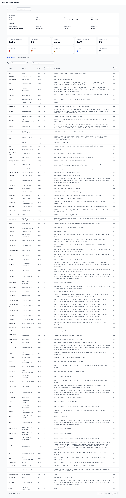
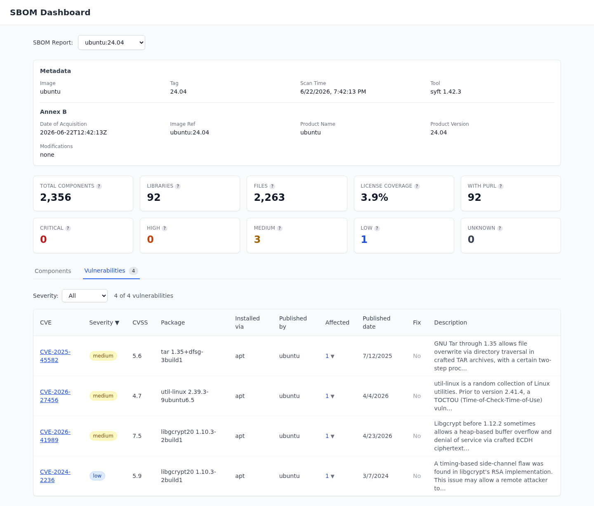

# SBOM Dashboard

A web dashboard that shows what is inside a container image and which of those packages have known security problems. It reads CycloneDX SBOM files produced by Syft, optionally enriched with Trivy vulnerability data, and presents the components and CVEs in a browser.

<details>
  <summary>Table of Contents</summary>

  - [Overview](#overview)
  - [Architecture](#architecture)
  - [Features](#features)
  - [Local Development](#local-development)
  - [Deployment](#deployment)
    - [Kubernetes (Helm)](#kubernetes-helm)
    - [Environment Variables](#environment-variables)
  - [API Endpoints](#api-endpoints)
  - [Configuration](#configuration)
  - [Demo Data](#demo-data)
  - [Enriching SBOMs](#enriching-sboms)
  - [Screenshots](#screenshots)

</details>

## Overview

The dashboard reads CycloneDX JSON files (`.cdx.json`) from a local directory (`STORAGE_PATH`). A FastAPI backend parses each file and exposes it over a REST API. A Next.js frontend lets you pick an SBOM and see two views: the **Components** tab (every package, its version, its license, and which package manager installed it) and the **Vulnerabilities** tab (every CVE, the affected package, the severity, and a link to the detail popup).



## Architecture

```
┌──────────────────────────────────────────────────────────────────────────────┐
│ Kubernetes / Docker Compose                                                   │
│                                                                               │
│  ┌───────────────────┐         ┌──────────────────────────────────────┐      │
│  │     Frontend      │────────▶│             Backend                  │      │
│  │   (Next.js :3000) │         │      (FastAPI :8000)                 │      │
│  └───────────────────┘         └──────────────────────────────────────┘      │
│                                              │                                │
│                                              ▼                                │
│                                     ┌────────────────┐     ┌──────────────┐  │
│                                     │  STORAGE_PATH  │◀────│  S3 Bucket   │  │
│                                     │  (volume mount)│     │  (CSI mount) │  │
│                                     └────────────────┘     └──────────────┘  │
│                                                                               │
└──────────────────────────────────────────────────────────────────────────────┘
                                                                    ▲
                                                                    │
                                                          ┌─────────────────┐
                                                          │  CI Workflow     │
                                                          │  (uploads SBOM) │
                                                          └─────────────────┘
```

The backend always reads SBOM files from a directory on disk (`STORAGE_PATH`). In production (Kubernetes), the storage directory is backed by an S3 bucket mounted transparently via the S3 CSI driver. Locally, `docker compose` mounts the `data-sample/` directory instead.

SBOM files are generated in CI using the [`anchore/sbom-action`](https://github.com/anchore/sbom-action) GitHub Action, which produces CycloneDX JSON output. A reusable workflow uploads the resulting `.cdx.json` files to the S3 bucket, making them immediately available in the dashboard.

## Features

- **SBOM picker** -- switch between multiple SBOMs from a dropdown.
- **Metadata panel** -- image name, version, scan timestamp, and the tool that produced the SBOM. If the file was enriched with Annex B compliance metadata, that block also shows here.
- **Summary cards** -- total components, library count, file count, license coverage, PURL availability, and severity counts (critical, high, medium, low, unknown) when vulnerabilities are present.
- **Components tab** -- searchable table of every package with its version, type, license, occurrences, and the package manager it came from (apt, npm, pypi, ...).
- **Vulnerabilities tab** -- one row per CVE with severity, CVSS, affected package, installed-via tag, who published the advisory, fix availability, and a description. Click a row to open a detail popup with full ratings, advisories, and CWEs.
- **Filesystem storage with caching** -- the backend reads files from a configurable directory and caches parsed SBOMs for five minutes.

## Local Development

### Prerequisites

- Docker and Docker Compose

### Running the Application

1. Clone the repository
2. The `data-sample/` directory contains a demo CycloneDX SBOM file. You can replace it or add additional `.cdx.json` files.
3. Start the application:
   ```bash
   docker compose up
   ```
4. Access the frontend at `http://localhost:3000`
5. The backend API is available at `http://localhost:8000`

The `data-sample/` directory is mounted as a volume to `/data` inside the backend container.

## Deployment

The application can be deployed to any container orchestration platform. The backend reads SBOM files from the directory specified by `STORAGE_PATH`. In production, the storage directory is typically backed by cloud object storage mounted into the container.

### Kubernetes (Helm)

Helm charts are provided in the `helm/` directory:

- `helm/sbom-viewer-backend/` -- backend deployment with S3-backed storage
- `helm/sbom-viewer-frontend/` -- frontend deployment with ingress

The backend uses the [Mountpoint for Amazon S3 CSI driver](https://github.com/awslabs/mountpoint-s3-csi-driver) to mount an S3 bucket as a read-only volume at `/app/storage`. This means SBOM files uploaded to the S3 bucket appear automatically in the backend's filesystem without any sync logic.

The flow:
1. CI workflow uploads `.cdx.json` files to an S3 bucket
2. The S3 CSI driver mounts the bucket as a PVC (`sbom-viewer-storage`)
3. The backend pod mounts this PVC read-only at `/app/storage`
4. New files in S3 are visible to the backend immediately

To deploy, update the placeholder values in `helm/sbom-viewer-backend/values.yaml` and `helm/sbom-viewer-frontend/values.yaml` (image registry, S3 bucket, region, domain, cert issuer).

### Environment Variables

Backend:

| Variable | Description | Default |
|----------|-------------|---------|
| `STORAGE_PATH` | Directory containing SBOM files | `/app/storage` |

Frontend:

| Variable | Description |
|----------|-------------|
| `BACKEND_API_URL` | URL of the backend API (e.g., `http://backend:8000`) |

SBOM files should follow the structure: `<repo>/<tag>.cdx.json` (e.g., `myorg/myimage/v1.0.0.cdx.json`).

The suffix tells the dashboard what kind of file it is, so use the right one when uploading:

| Suffix | Meaning |
|--------|---------|
| `.cdx.json` | Raw Syft SBOM. Components tab only. |
| `.trivy.cdx.json` | Trivy vulnerability scan output. |
| `.enriched.cdx.json` | Syft + Trivy merged (and optionally Annex B). The dashboard auto-prefers this one and enables the Vulnerabilities tab. |

If you upload a merged file using the plain `.cdx.json` suffix, the dashboard will treat it as a raw SBOM and the Vulnerabilities tab will stay disabled.

## API Endpoints

| Method | Path | Description |
|--------|------|-------------|
| `GET` | `/api/sboms` | List available SBOMs (returns id, image, version, timestamp, which views exist) |
| `GET` | `/api/sboms/{sbom_id}/summary` | Get summary statistics (component counts, license coverage, vulnerability counts, metadata) |
| `GET` | `/api/sboms/{sbom_id}/components` | Get raw components list (supports `type`, `name`, `offset`, `limit` query params) |
| `GET` | `/api/sboms/{sbom_id}/components/grouped` | Same as above, but deduplicated by `(name, version, type)` with aggregated purls, licenses, and counts |
| `GET` | `/api/sboms/{sbom_id}/vulnerabilities` | List CVEs found in this SBOM (one row per CVE, with affected components) |
| `GET` | `/api/sboms/{sbom_id}/vulnerabilities/{cve_id}` | Full detail for a single CVE — ratings, advisories, CWEs, every affected package |

The `sbom_id` is a path-style identifier derived from the file path relative to `STORAGE_PATH`. For example, a file at `myorg/myimage/v1.0.0.cdx.json` has the `sbom_id` of `myorg/myimage/v1.0.0`.

## Configuration

### Backend

| Variable | Description | Default |
|----------|-------------|---------|
| `STORAGE_PATH` | Directory containing `.cdx.json` files | `/app/storage` |

The backend recursively scans `STORAGE_PATH` for all `.cdx.json` files. The in-memory cache holds up to 20 SBOM entries with a 5-minute TTL.

### Frontend

| Variable | Description |
|----------|-------------|
| `BACKEND_API_URL` | Backend API base URL (used for server-side requests) |

## Demo Data

The `data-sample/` directory is included in the repository so the dashboard works the moment you run `docker compose up`. It contains:

- `sbom.cdx.json` -- a raw Syft SBOM used as the default demo.
- `ubuntu/24.04.cdx.json` -- a raw Syft SBOM for Ubuntu 24.04.
- `ubuntu/24.04.trivy.cdx.json` -- the same SBOM after a Trivy scan.
- `ubuntu/24.04.enriched.cdx.json` -- the merged file with both vulnerabilities and Annex B metadata. Select **ubuntu:24.04** in the dropdown to see the Vulnerabilities tab in action.

To add your own SBOM, drop any `.cdx.json` file into `data-sample/`. The simplest way to produce one is with [Syft](https://github.com/anchore/syft):

```bash
syft <image> -o cyclonedx-json > data-sample/<image>.cdx.json
```

A raw Syft SBOM gives you the Components tab. To light up the Vulnerabilities tab too, see [Enriching SBOMs](#enriching-sboms) below.

## Enriching SBOMs

The Vulnerabilities tab needs an SBOM that has been merged with a Trivy vulnerability scan. The repo provides two ways to produce one.

### Using the GitHub composite action (recommended for CI)

The action at [`actions/enrich-sbom/`](actions/enrich-sbom/) takes a Syft SBOM, runs Trivy against it, merges the vulnerabilities, and injects Annex B compliance properties. From any GitHub workflow:

```yaml
- uses: amir-bialek/sbom-viewer/actions/enrich-sbom@enrich-sbom-v1.0.0
  with:
    syft-sbom-path: path/to/syft.cdx.json
    output-path: path/to/enriched.cdx.json
    enable-trivy: 'true'
    enable-annex-b: 'true'
```

The `enable-trivy` and `enable-annex-b` flags are independent, so you can opt into either step on its own.

### Using the scripts directly (for local testing)

Both enrichment steps are plain Python scripts under [`scripts/`](scripts/) with no dependencies beyond the standard library. Run them yourself after producing a Trivy SBOM:

```bash
trivy sbom syft.cdx.json -f cyclonedx -o trivy.cdx.json
python3 scripts/merge-trivy-vulns.py syft.cdx.json trivy.cdx.json merged.cdx.json
python3 scripts/inject-annex-b.py merged.cdx.json enriched.cdx.json
```

The merge step refuses to write output if Trivy mutated the SBOM identity (`serialNumber`, `specVersion`, `metadata`, `components`, or `dependencies`). That is intentional -- it protects the inventory in `syft.cdx.json` from being silently rewritten by the scanner.

## Screenshots

The Vulnerabilities tab, showing CVEs from Trivy with the affected package, the package manager it came from, and the advisory source:


