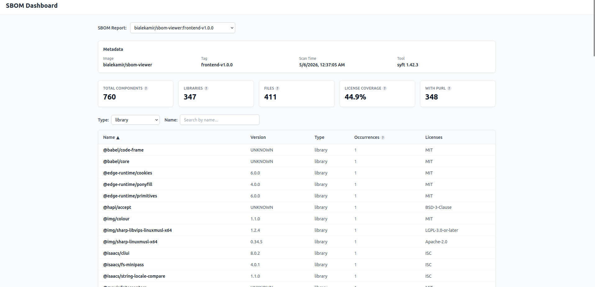
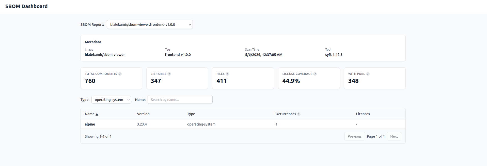
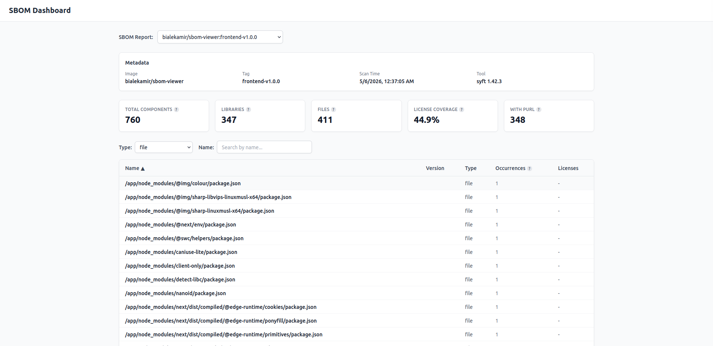

# SBOM Dashboard

A full-stack application that parses and visualizes CycloneDX Software Bill of Materials (SBOM) files. It provides a dashboard with summary statistics, component breakdowns by type, license coverage metrics, and a searchable/filterable components table with pagination.

<details>
  <summary>Table of Contents</summary>

  - [Overview](#overview)
  - [Architecture](#architecture)
  - [Features](#features)
  - [Local Development](#local-development)
  - [Deployment](#deployment)
    - [Kubernetes (Helm)](#kubernetes-helm)
    - [Environment Variables](#environment-variables)
  - [API Endpoints](#api-endpoints)
  - [Configuration](#configuration)
  - [Demo Data](#demo-data)
  - [Screenshots](#screenshots)

</details>

## Overview

The SBOM Dashboard reads CycloneDX JSON files (`.cdx.json`) from a local filesystem directory (`STORAGE_PATH`). A FastAPI backend parses the SBOM data and exposes it through a REST API. A Next.js frontend provides an interactive dashboard where users can select an SBOM, view summary cards (total components, libraries, files, license coverage, PURL availability), filter components by type or name, and paginate through results.



## Architecture

```
┌──────────────────────────────────────────────────────────────────────────────┐
│ Kubernetes / Docker Compose                                                   │
│                                                                               │
│  ┌───────────────────┐         ┌──────────────────────────────────────┐      │
│  │     Frontend      │────────▶│             Backend                  │      │
│  │   (Next.js :3000) │         │      (FastAPI :8000)                 │      │
│  └───────────────────┘         └──────────────────────────────────────┘      │
│                                              │                                │
│                                              ▼                                │
│                                     ┌────────────────┐     ┌──────────────┐  │
│                                     │  STORAGE_PATH  │◀────│  S3 Bucket   │  │
│                                     │  (volume mount)│     │  (CSI mount) │  │
│                                     └────────────────┘     └──────────────┘  │
│                                                                               │
└──────────────────────────────────────────────────────────────────────────────┘
                                                                    ▲
                                                                    │
                                                          ┌─────────────────┐
                                                          │  CI Workflow     │
                                                          │  (uploads SBOM) │
                                                          └─────────────────┘
```

The backend always reads SBOM files from a directory on disk (`STORAGE_PATH`). In production (Kubernetes), the storage directory is backed by an S3 bucket mounted transparently via the S3 CSI driver. Locally, `docker compose` mounts the `data-sample/` directory instead.

SBOM files are generated in CI using the [`anchore/sbom-action`](https://github.com/anchore/sbom-action) GitHub Action, which produces CycloneDX JSON output. A reusable workflow uploads the resulting `.cdx.json` files to the S3 bucket, making them immediately available in the dashboard.

## Features

- **SBOM Selection** -- dropdown to switch between multiple SBOMs when more than one is available
- **Metadata Panel** -- displays image name, version, generation timestamp, and the tool used to create the SBOM
- **Summary Cards** -- total components, library count, file count, license coverage percentage, and PURL availability
- **Component Type Breakdown** -- visual count of components grouped by CycloneDX type (library, file, framework, etc.)
- **Filterable Components Table** -- filter by component type and search by name
- **Pagination** -- paginated results for large SBOMs (100 components per page)
- **License Extraction** -- parses and displays SPDX license IDs for each component
- **Filesystem Storage with Caching** -- reads SBOM files from a configurable directory with in-memory caching (5-minute TTL)

## Local Development

### Prerequisites

- Docker and Docker Compose

### Running the Application

1. Clone the repository
2. The `data-sample/` directory contains a demo CycloneDX SBOM file. You can replace it or add additional `.cdx.json` files.
3. Start the application:
   ```bash
   docker compose up
   ```
4. Access the frontend at `http://localhost:3000`
5. The backend API is available at `http://localhost:8000`

The `data-sample/` directory is mounted as a volume to `/data` inside the backend container.

## Deployment

The application can be deployed to any container orchestration platform. The backend reads SBOM files from the directory specified by `STORAGE_PATH`. In production, the storage directory is typically backed by cloud object storage mounted into the container.

### Kubernetes (Helm)

Helm charts are provided in the `helm/` directory:

- `helm/sbom-viewer-backend/` -- backend deployment with S3-backed storage
- `helm/sbom-viewer-frontend/` -- frontend deployment with ingress

The backend uses the [Mountpoint for Amazon S3 CSI driver](https://github.com/awslabs/mountpoint-s3-csi-driver) to mount an S3 bucket as a read-only volume at `/app/storage`. This means SBOM files uploaded to the S3 bucket appear automatically in the backend's filesystem without any sync logic.

The flow:
1. CI workflow uploads `.cdx.json` files to an S3 bucket
2. The S3 CSI driver mounts the bucket as a PVC (`sbom-viewer-storage`)
3. The backend pod mounts this PVC read-only at `/app/storage`
4. New files in S3 are visible to the backend immediately

To deploy, update the placeholder values in `helm/sbom-viewer-backend/values.yaml` and `helm/sbom-viewer-frontend/values.yaml` (image registry, S3 bucket, region, domain, cert issuer).

### Environment Variables

Backend:

| Variable | Description | Default |
|----------|-------------|---------|
| `STORAGE_PATH` | Directory containing SBOM files | `/app/storage` |

Frontend:

| Variable | Description |
|----------|-------------|
| `BACKEND_API_URL` | URL of the backend API (e.g., `http://backend:8000`) |

SBOM files should follow the structure: `<repo>/<tag>.cdx.json` (e.g., `myorg/myimage/v1.0.0.cdx.json`).

## API Endpoints

| Method | Path | Description |
|--------|------|-------------|
| `GET` | `/api/sboms` | List available SBOMs (returns id, image, version, timestamp) |
| `GET` | `/api/sboms/{sbom_id}/summary` | Get summary statistics (component counts, license coverage, metadata) |
| `GET` | `/api/sboms/{sbom_id}/components` | Get components list (supports `type`, `name`, `offset`, `limit` query params) |

The `sbom_id` is a path-style identifier derived from the file path relative to `STORAGE_PATH`. For example, a file at `myorg/myimage/v1.0.0.cdx.json` has the `sbom_id` of `myorg/myimage/v1.0.0`.

## Configuration

### Backend

| Variable | Description | Default |
|----------|-------------|---------|
| `STORAGE_PATH` | Directory containing `.cdx.json` files | `/app/storage` |

The backend recursively scans `STORAGE_PATH` for all `.cdx.json` files. The in-memory cache holds up to 20 SBOM entries with a 5-minute TTL.

### Frontend

| Variable | Description |
|----------|-------------|
| `BACKEND_API_URL` | Backend API base URL (used for server-side requests) |

## Demo Data

The `data-sample/` directory is included in the repository and contains a sample CycloneDX SBOM file (`sbom.cdx.json`). This allows running the application immediately after cloning without needing to generate or download SBOM data.

To generate your own SBOM files, use a tool like [Syft](https://github.com/anchore/syft):

```bash
syft <image> -o cyclonedx-json > data-sample/sbom.cdx.json
```

## Screenshots




